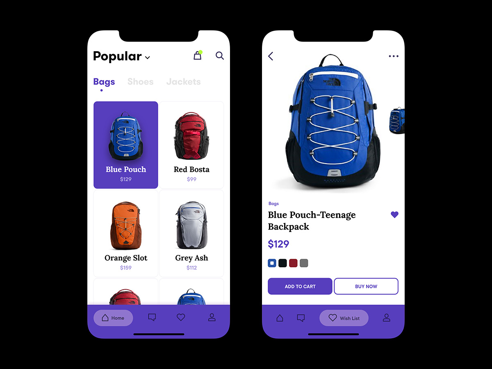
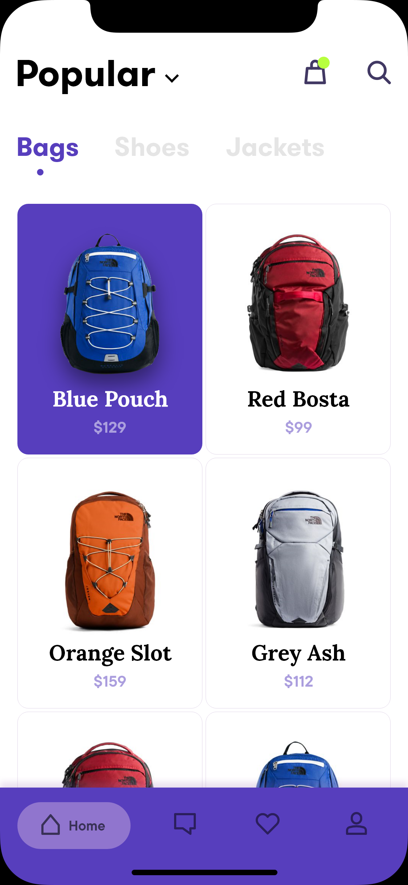
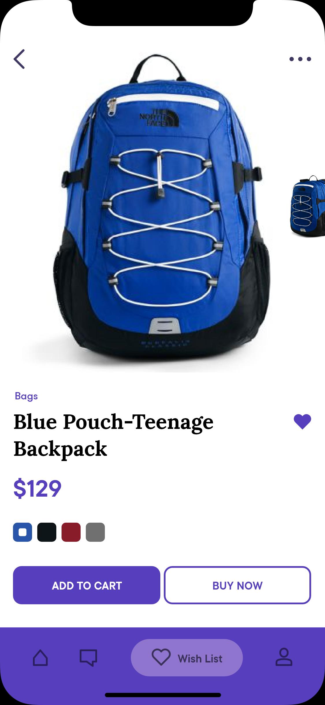

# Backpack Mobile App

App concept created with Flutter using Dart programming language, inspired by [Backpack App](https://www.uplabs.com/posts/backpack-app-abe50ce8-1dfe-4c0b-9afb-9d81a49d4e58)
design found in Uplabs.

## About
The app was created to simulate all the system behind the UI kit in the link. There's no code on backend or other web service. The app is all contained in this repository. The models classes was created to better representate an official development, the repositories classes simulate a web request.

## The Inspiration
The images below show the inspiration behind the concept app.

All Screens            |  Listing Screen             |  Detail Screen
:-------------------------:|:-------------------------:|:-------------------------:
  |    |  

  
  

## Notes
Still in progress
